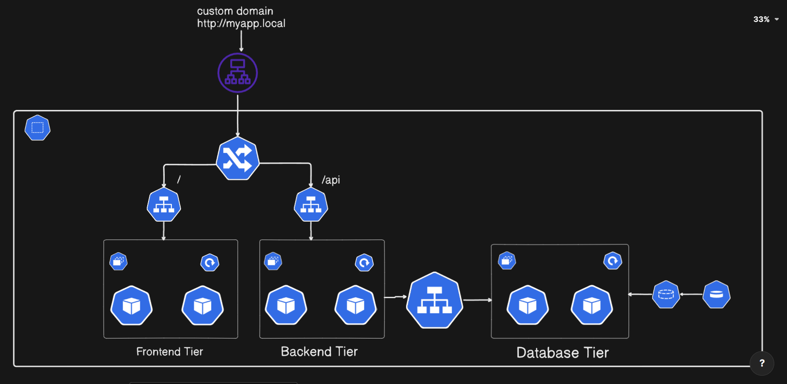

# **From Zero to Kubernetes: Hosting a 3-Tier Web App with NGINX Ingress on EKS**

## **What i will help you to Deploy🤔:**

A **production-ready** full-stack web application,
with (React frontend + Node.js backend + MongoDB Database),  
deployed on **AWS EKS** using Kubernetes and exposed via **NGINX Ingress Controller**.

## **Prerequisites**

- AWS account
- IAM Configuration
  - Create a user `eks-admin` with `AdministratorAccess`.
  - Generate Security Credentials: `Access Key` and `Secret Access Key`.
- Basic Docker and Kubernetes knowledge

## **Architecture of Deployment**


*Figure: High-level architecture showing React frontend, Node.js backend, and MongoDB database deployed on AWS EKS with NGINX Ingress Controller.*

## **Launch a Bastion Host (EC2 t2.micro)**

> **Note:** This Bastion Host is not the part of EKS cluster, but we will use this instance to install neccessay configuration and EKS cluster.

_Do these below steps in Bastion Host_

- ### **Install AWS CLI v2**

  ```
  curl "https://awscli.amazonaws.com/awscli-exe-linux-x86_64.zip" -o "awscliv2.zip"
  sudo apt install unzip
  unzip awscliv2.zip
  sudo ./aws/install -i /usr/local/aws-cli -b /usr/local/bin --update
  aws configure
  ```

- ### **Install Docker**
  ```
  sudo apt-get update
  sudo apt install docker.io
  docker ps
  sudo chown $USER /var/run/docker.sock
  ```
- ### **Install Kubectl**
  ```
  curl -o kubectl https://amazon-eks.s3.us-west-2.amazonaws.com/1.19.6/2021-01-05/bin/linux/amd64/kubectl
  chmod +x ./kubectl
  sudo mv ./kubectl /usr/local/bin
  kubectl version --short --client
  ```
- ### **Install eksctl**
  ```
  curl --silent --location "https://github.com/weaveworks/eksctl/releases/latest/download/eksctl_$(uname -s)_amd64.tar.gz" | tar xz -C /tmp
  sudo mv /tmp/eksctl /usr/local/bin
  eksctl version
  ```
- ### **setup clusetr**

    ```
    eksctl create cluster --name three-tier-cluster --region ap-south-1 --node-type t2.medium --nodes-min 2 --nodes-max 2
    aws eks update-kubeconfig --region us-west-2 --name three-tier-cluster
    kubectl get nodes
     ```

    ## **Deploy the Application**

    ### **1. Clone the Repository**
    ```bash
    git clone <your-repo-url>
    cd <repo-directory>
    ```

    ### **2. Apply Kubernetes Manifests**
    ```bash
    kubectl apply -f .
    ```
    ### **2. Install Nginx Ingress Controller on AWS**
    ```bash
    kubectl apply -f https://raw.githubusercontent.com/kubernetes/ingress-nginx/controller-v1.11.1/deploy/static/provider/aws/deploy.yaml
    ```


    ### **3. Get External IP of NGINX Ingress**
    ```bash
    kubectl get svc -n ingress-nginx
    nslookup <external-ip>
    ```

    ### **4. Update `/etc/hosts`**
    Add the following line to your `/etc/hosts` file:
    ```
    <external-ip> your-app-domain.com
    ```

    ### **5. Access the Application**
    Open your browser and navigate to:
    ```
    http://your-app-domain.com
    ```
    ### **5. Clean up**
    Deleting cluster
    ```
    eksctl delete cluster --name three-tier-cluster --region ap-south-1
    ```
